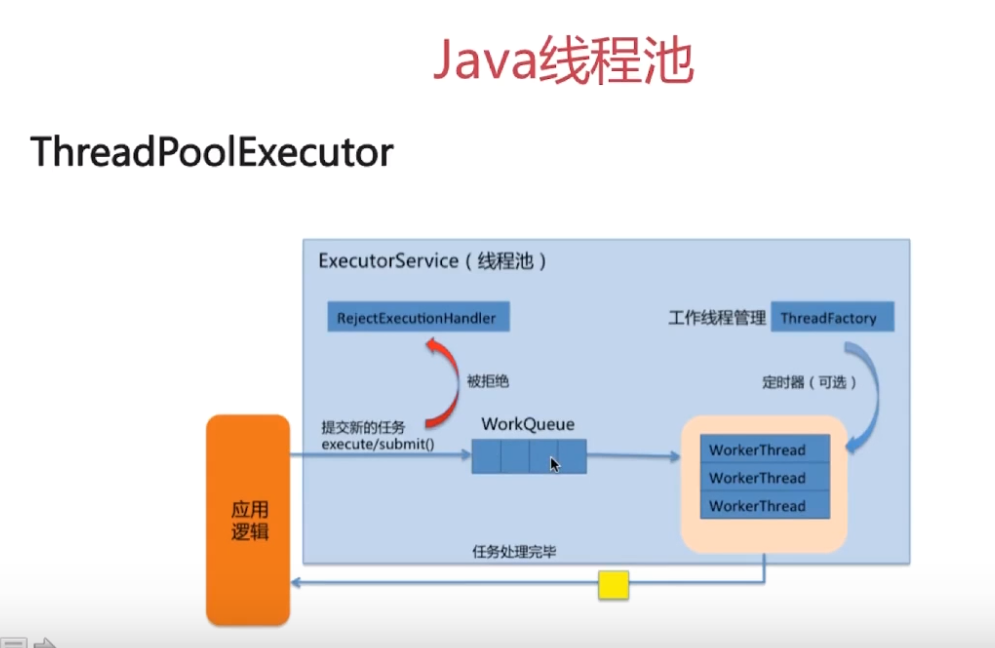
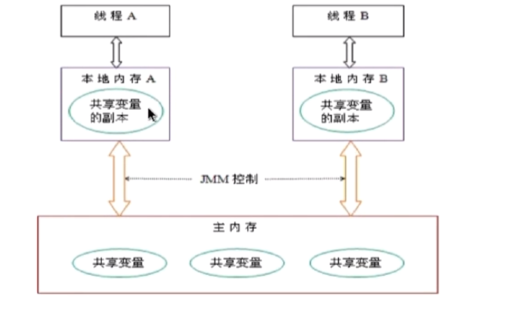

# 最近常被问到的面试问题

 ## Java基础

 ### CAS操作
 旧值  新值  修改值


 缺点：
  1. 循环时间长，开销很大（因为有个while循环）
  2. 只能保证一个共享变量原子操作
  3. ABA问题


  ### Java线程池

  #### Excutors 通用线程池去创建不同的线程池

  Callable弥补了Runnble无法返回结果的短板

  Excutors下面有五个不同的线程池

  启动接口为excute

  #### J.U.C包下面的三个Excutor接口

  - Excutor：运行新任务的简单接口
  - ExcutorService：具备管理执行期和任务生命周期的方法，提交任务机制更加完善
  - ScheduledExcutorService:支持定期执行任务

  #### threadPoolExcutor
  


**TreadPoolExcutor构造函数：**
- 核心线程数
- 最大线程数
- 等待队列大小
- 线程池维护线程的等待时间
- 创建新线程
- 线程池饱和策略


 ### HashMap

 #### ConcurrentHashMap


 - 线程安全的
 - 通过把整个Map分为N个Segment，可以提供相同的线程安全，但是效率提升N倍，默认提升16倍。(读操作不加锁，由于HashEntry的value变量是 volatile的，也能保证读取到最新的值。)
 - Hashtable的synchronized是针对整张Hash表的，即每次锁住整张表让线程独占，ConcurrentHashMap允许多个修改操作并发进行，其关键在于使用了锁分离技术
 - 有些方法需要跨段，比如size()和containsValue()，它们可能需要锁定整个表而而不仅仅是某个段，这需要按顺序锁定所有段，操作完毕后，又按顺序释放所有段的锁
 - 扩容：段内扩容（段内元素超过该段对应Entry数组长度的75%触发扩容，不会对整个Map进行扩容），插入前检测需不需要扩容，有效避免无效扩容


 ## java虚拟机
 ### JMM

 


## MySQL相关
### MVCC

#### 什么是MVCC?
英文全称为Multi-Version Concurrency Control,翻译为中文即 多版本并发控制。在小编看来，他无非就是乐观锁的一种实现方式。在Java编程中，如果把乐观锁看成一个接口，MVCC便是这个接口的一个实现类而已。

MVCC的实现，通过保存数据在某个时间点的快照来实现的。这意味着一个事务无论运行多长时间，在同一个事务里能够看到数据一致的视图。根据事务开始的时间不同，同时也意味着在同一个时刻不同事务看到的相同表里的数据可能是不同的。


 ## Redis相关

 ### redis数据淘汰策略
 redis 内存数据集大小上升到一定大小的时候，就会施行数据淘汰策略。redis 提供 6种数据淘汰策略：

 ```
volatile-lru:从设置了过期时间的数据集中，选择最近最久未使用的数据释放；

allkeys-lru:从数据集中(包括设置过期时间以及未设置过期时间的数据集中)，选择最近最久未使用的数据释放；

volatile-random:从设置了过期时间的数据集中，随机选择一个数据进行释放；

allkeys-random:从数据集中(包括了设置过期时间以及未设置过期时间)随机选择一个数据进行入释放；

volatile-ttl：从设置了过期时间的数据集中，选择马上就要过期的数据进行释放操作；

noeviction：不删除任意数据(但redis还会根据引用计数器进行释放),这时如果内存不够时，会直接返回错误。

 ```


 ### redis持久化

 #### RDB(快照)
 - RDB持久化方式能够在指定的时间间隔能对你的数据进行快照存储。
 - RDB 在保存 RDB 文件时父进程唯一需要做的就是 fork 出一个子进程,接下来的工作全部由子进程来做，父进程不需要再做其他 IO 操作，所以 RDB 持久化方式可以最大化 Redis 的性能。
 - 与AOF相比,在恢复大的数据集的时候，RDB 方式会更快一些。


**当 Redis 需要保存 dump.rdb 文件时， 服务器执行以下操作:**

1. Redis 调用forks. 同时拥有父进程和子进程。
2. 子进程将数据集写入到一个临时 RDB 文件中。
3. 当子进程完成对新 RDB 文件的写入时，Redis 用新 RDB 文件替换原来的 RDB 文件，并删除旧的 RDB 文件。

### 一致性Hash算法


 #### AOF
 AOF通过的是append方法对写操作进行持久化


 ## Spring 相关
