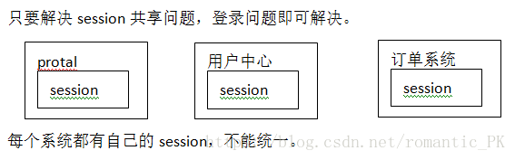
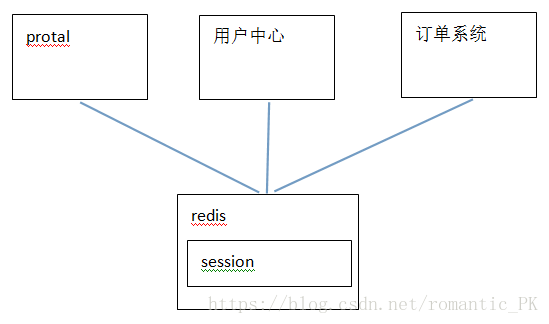
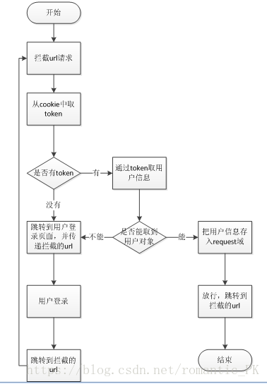

## 项目相关知识

### Redis实现单点登录系统
简单使用REDIS实现SSO单点登录

每个web应用都有自己的session，那如何在分布式或者集群环境下统一session，即如何实现单点登录，如下图

#### 解决方案
把session数据存放在redis，统一管理，向外提供服务接口，redis可以设置过期时间，对应session的失效时间

        优点：存取速度快，效率高；无单点故障，可以部署集群；自定义登录页面（即每个应用都可以设计自己的登录页面）

        缺点：必须部署redis；所有程序自行开发，例如：登录、登出等。

 SSO需要提供的接口如下:
 1. 登录，根据用户名和密码查询数据库，如存在则生成token保存在redis，token作为key，用户信息作为value，设置过期时间，然后把token保存到cookie，固定key，token作为value；
 2. 根据token查询用户信息，根据token作为key查询redis的值，如存在重新设置过期时间（即已登录），不存在即未登录
 3. 登出，根据token作为key删除redis的值

 

 单点登录功能分析
请求的url：/user/login
请求的方法：POST
参数：username、password，表单提交的数据。可以使用方法的形参接收。
返回值：json数据，包含一个token。
业务逻辑：
登录的业务流程：

登录的处理流程：
1. 登录页面提交用户名密码。
2. 登录成功后生成token。Token相当于原来的jsessionid，字符串，可以使用uuid。
3. 把用户信息保存到redis。Key就是token，value就是TbUser对象转换成json。
4. 使用String类型保存Session信息。可以使用“前缀:token”为key
5. 设置key的过期时间。模拟Session的过期时间。一般半个小时。
6. 把token写入cookie中。
7. Cookie需要跨域。例如www.jd.com\sso.jd.com\order.jd.com，可以使用工具类。
8. Cookie的有效期。关闭浏览器失效。
9. 登录成功。
